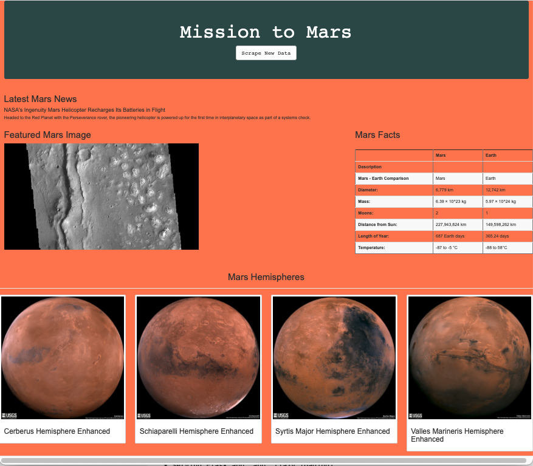

# Mission-to-Mars

## Summary

This project was developed to collect data from various webpages through webscraping using Python and Mongo DB.  The data collected 
web scrapping for information related to the NASA's goal to send a manned mission to Mars.  The data was collected using Python code that scraped various webpages for recent web posts about Mars and relevent data on the planet to be made available for users.  The data was stored on a Mongo database that could be accessed by a Flask app that presented the various data collected from the websites.  Additional editting to the HTML script was completed to customize the view of the webpage and present the data in a manor that was appealing to users.

## Results

Using Python code created in Jupyter notebook, a script to collect recent posts on the website https://redplanetscience.com which contained recent news about Mars was collected along with the most recent images from the website https://spaceimages-mars.com.  This data was combined with facts about Mars that was collected from the website https://galaxyfacts-mars.com along with images of the hemispheres of Mars that were made available on the website https://marshemispheres.com/.  This data was collected by scraping the webpages for the relevent links and text that was stored in a MongoDB database.  This data collected was stored in a Mongo database as the information, however relevent, was not structured and would be difficult to access using an SQL style database.  The data stored in the Mongo database accessed through a flask app that created a local server webpage that was populated by the data collected in the webscraping script and stored in the database.  The webpage also allow the user to rescrape the webpages to update the database and present the update data on the webpage. 

### Example of the Mission to Mars webpage

### Appended Mission to Mars project

The initial webpage was functional but upon further inspection there was additional information that was required to improve the users experience.  Looking at the hemisphere data is was determined that further information related to the image would help the inform the user of what they were looking at.  Fortunately on the website there was text that contained a description of each image that was available.  The scraping script was adapted to extract this additional information and store it in the Mongo database along with the other data for the hemispheres of Mars.  

### Example of the appended Mission to Mars webpage

## Summary

From this project it is possible to see the power of using Python to automate webscrapping to collect relevent data for users.  This process can access data from a number of sources and store it in an unstructured database that can be accessed by user through a webpage.  This provides an effective and efficent manner of data collection, storage and accessibility that can provide data for users without them having to access a number of websites. 

